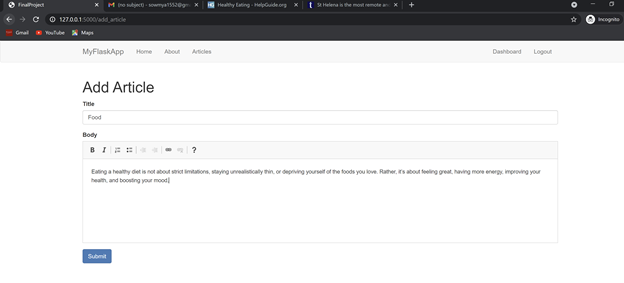
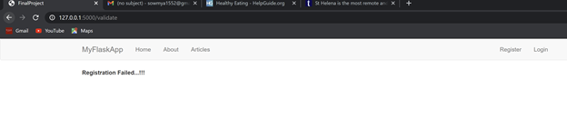

## Final Web Application - Feature 2 by Sowmya Kothapalli
#### Create a login and registration process that includes email verification.  You can use a service like SendGrid to send email and you should look for a Flask Plugin to help.

#### Step 1: Move to the branch for feature 1.

#### Step 2: Install the files and open them in Pycharm

#### Step 3: To Set up the dockerfile, select “edit configuration” on the top and create a docker-compose config. Make sure that you select the correct docker-compose.yml and add it to the box with the same label.

#### Step 4: Next press the run button next to the docker compose you just created and it will start the docker container.

#### Step 5: Go to View -> Tool Windows -> Database. Create a database with the plus button on the window that appears. Select MySQL and under user enter root and for password enter root. The port will be 32000 and the database will be treesData. Test the connection to ensure that it works.

#### Step 6: Run the docker compose, once deployed, navigate to Docker->compose->app->Flaskapp and click on the http server.

#### Localhost or http://127.0.0.1:5000/ opens final flaskproject with registration, login and email confirmation.

#### Register with your gmail account and click on submit.

#### OTP sent for email verification

### Add OTP on website to procced with confirmation

### Login with username and password

### Add article and add content

### Articles added to dashboard

### Logout

### Unsuccessful email verification.

### Submit and enter incorrect otp to see failed registration

### Enter wrong username or password to see invalid login message 

