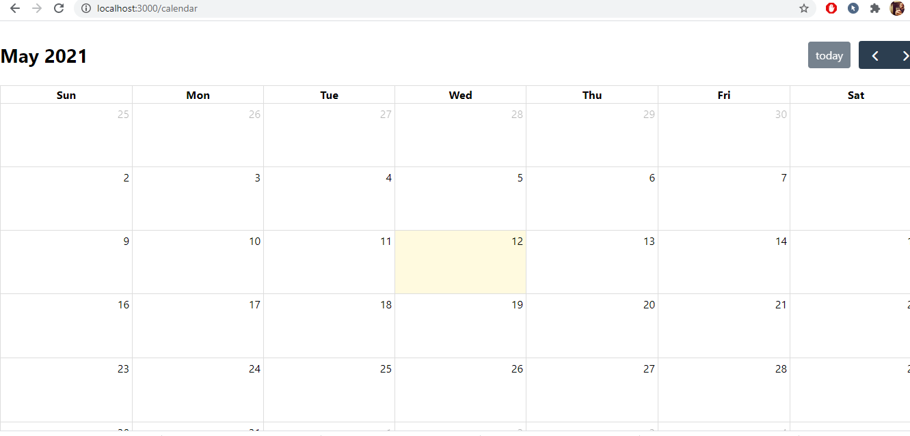
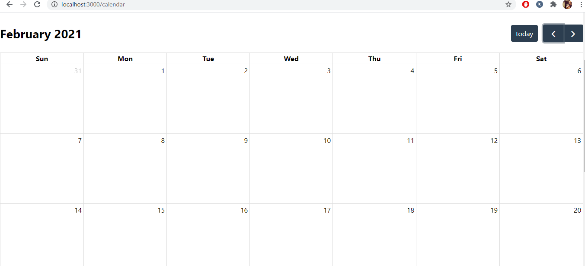
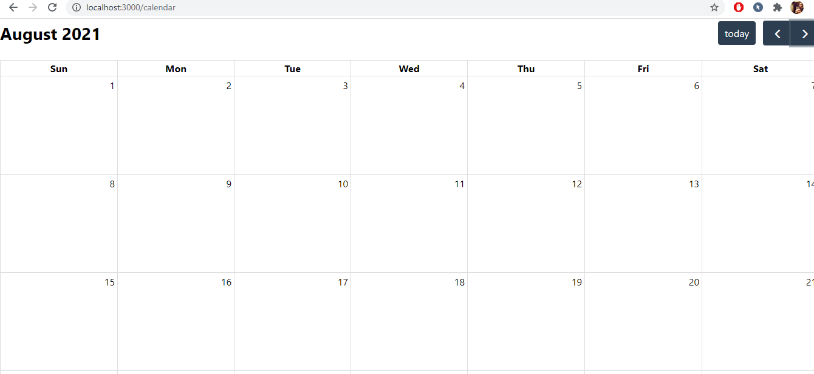
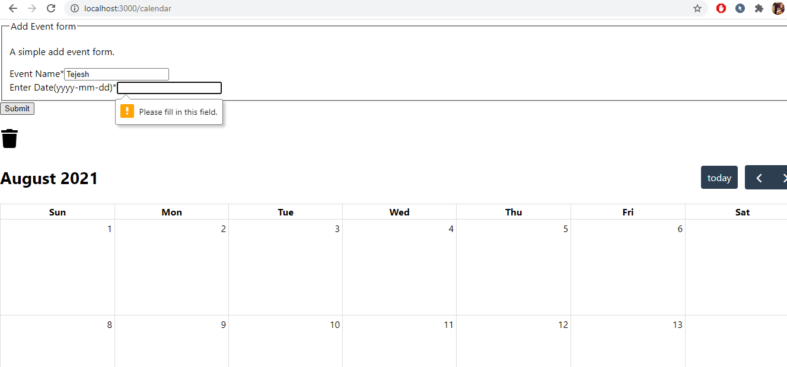
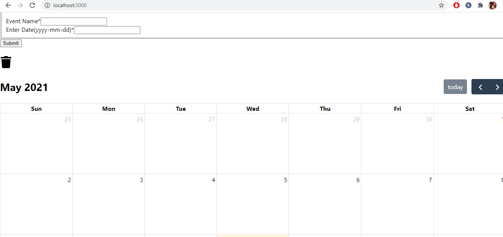

## Final Web Application - Feature 3
####  Create a calendar display and retrieve data out of Google Calendar.   Allow someone to add an even to their Google Calendar and display it on the page.  You can use the HTML full calendar plugin here (Links to an external site.) and you can probably make an iCal Feed from your Google calendar to feed into it, but you will need to cache the data locally in the database and update the data periodically between each request is made.  For example, if the calendar data has not been updated in 5 minutes, make a request to retrieve the data and update the database and then display that data in the fullCalendar page.

#### Step 1: Move to the branch for feature 1.

#### Step 2: Install the files and open them in Pycharm.

### Step 3: To run the project, use command "npm install" to install the packages.

### Step 4: Use command "npm start" to run the project on your local.

### The calendar page opening up on local with current date.

### You can scroll to a previous date and a date in the future easily.

### Credentials required to add events in the calendar. If not, pop up message will be displayed.

### Adding an event in the calendar

### Adding multiple events on the same day in the calendar

### Deleting an event in the calendar

